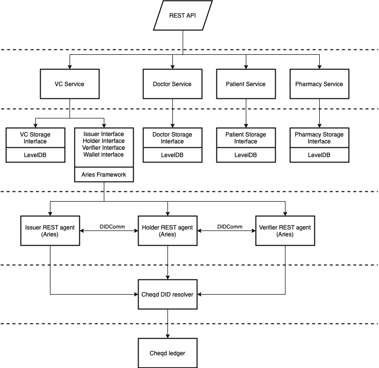

# SSI medical prescriptions demo

Web application demonstrating usage of self-sovereign identity principles for issuance and verification of medical prescriptions.

The application is based on [aries-framework-go](https://github.com/hyperledger/aries-framework-go) and [cheqd-node](https://github.com/cheqd/cheqd-node). It uses [W3C verifiable credentials](https://www.w3.org/TR/vc-data-model/) and Hyperledger Aries Issuance and Presentation protocols over DIDComm.

## Demo server

### Build demo server
```bash
make demo-server
```

### Run demo server and swagger ui using docker
1. Run demo server
    ```
    make run-demo-server
    ```
    - Demo server api will be available at http://localhost:8888
    - OpenAPI will be available at http://localhost:8889/openapi
    - To create DIDs and add private keys to wallet manually follow [how-to-add-dids-manually.md](./docs/how-to-add-dids-manually.md)

2. Stop demo server
    ```bash
    make stop-demo-server
    ```

## Mock server and test

### Generate stubs from openapi specs
1. Install oapi-codegen:
    ```bash
    go install github.com/deepmap/oapi-codegen/cmd/oapi-codegen@latest
    ```
    ```bash
    export PATH=$PATH:$HOME/go/bin
    ```
2. Generate mock stubs for openapi specs
    ```bash
    oapi-codegen -package rest ./api/openapi-spec/openapi.yml > internal/controller/rest/ssimp_rest.gen.go
    ```
### Build mock server
```bash
make mock-server
```

### Run mock server and swagger ui using docker
1. Run mock server container
    ```
    make run-mock-server
    ```
    - Mock server api will be available at http://localhost:8989
    - OpenAPI will be available at http://localhost:8889/openapi

2. Stop mock server
    ```bash
    make stop-mock-server
    ```
### Run unit tests:
```bash
make run-unit-tests
```

### Run integration tests
1. Run script for adding doctor, patient, pharmacy wallets
    ```bash
    bash integration_tests/preperation/add_wallets.sh     
    ```
2. Run integration tests
    ```bash
    make run-integration-tests
    ```

## Components
- [aries-framework-go][1] framework is used as an underlying verifiable credential engine
- [cheqd][2] ledger is used to store and resolve Decentralized Identifiers (DIDs)

## Architecture



[1]: https://github.com/hyperledger/aries-framework-go
[2]: https://github.com/cheqd/cheqd-node